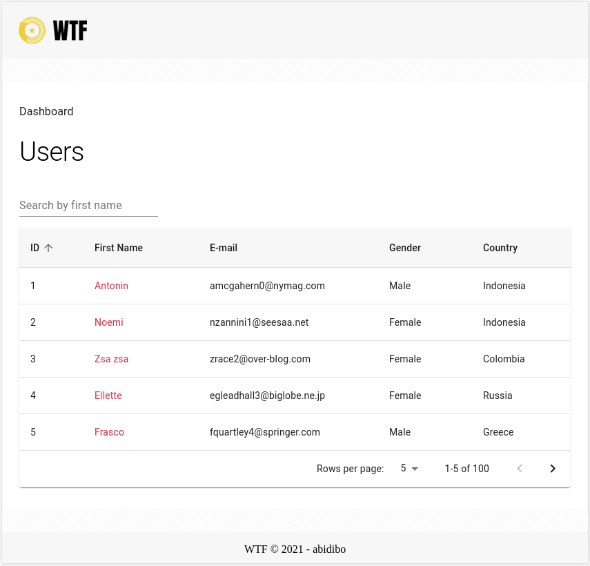

# WTF

## Getting started

Client & Server applications for a simple dashboard displaying a list of users and users' detail pages.



You can run the entire project in docker containers:

``` bash
$ git clone https://github.com/abidibo/wtf.git
$ cd wtf
$ ./run.sh
```

Visit http://localhost:9000

### Tests

``` bash
$ ./test.sh
```

Will launch unit tests of client and server applications inside their containers.

### Utilities

``` bash
$ ./shell.sh server
```

Opens a ssh bash session inside the server container (node)

``` bash
$ ./shell.sh client
```

Opens a ssh shell session inside the client container (node alpine)

## Server

The server application is a node express application.

### Docker

It builds a docker container from `node:latest` image containing the app.
As default the server is running on `localhost:3000` with live reload support. Change whe `docker-compose.yml` in order to set a different port.

The `src` directory is mounted as binded volume: changes are reflected to docker container and trigger a reload.

### Local machine

You can of course set up the environment in your local machine:

``` bash
$ cd server
$ npm install
$ npm start
```

The server runs on `localhost:3000`, with live reload support.

#### Tests

| Command | Description |
|:------- |:----------- |
| `npm test` | Runs all tests and exits |
| `npm test:watch` | Runs tests in watch mode |
| `npm test:coverage` | Runs tests and produces a coverage report |

## Client

The client application is a React + Redux app with styled components.

### Docker

It builds a docker container from `node:13.12.0-alpine` image containing the app.
The webpack dev server is running on `localhost:9000` with live reload support. 

The `src` directory is mounted as binded volume: changes are reflected to docker container and trigger a reload.

### Local machine

``` bash
$ cd client
$ npm install
$ npm start
```

#### Tests

| Command | Description |
|:------- |:----------- |
| `npm test` | Runs all tests and exits |
| `npm test:watch` | Runs tests in watch mode |
| `npm test:coverage` | Runs tests and produces a coverage report |

The application runs on `localhost:9000`

#### TODO

- `grep -B 1 -A 1 --exclude *.md "@TODO" ./*.*`
- `grep -B 1 -A 1 -R "@TODO" client/`
- `grep -B 1 -A 1 -R "@TODO" server/`
- Go on with `feature/ramda` branch...
- ...and so much more
